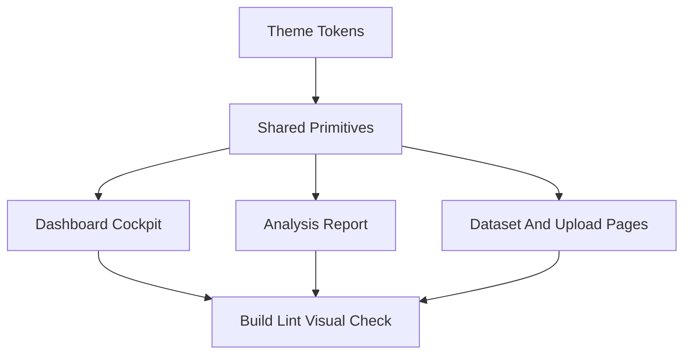

# Finance-Inspired RCA Theme Direction

## Reference Signals
- [Stripe dashboard redesign](https://matthewstrom.com/projects/stripe-dashboard/) emphasizes tokenized theming, responsive dashboard templates, accessibility, and dark mode that remains readable in complex tables and filters.
- [Ramp platform/product work](https://bakkenbaeck.com/case/ramp) points toward bento-style product graphics, spend-control language, and executive clarity around time, money, and control.
- [Plaid dashboard redesign](https://plaid.com/blog/dashboard-redesign-2023/) reinforces unified navigation, easier product discovery, role-oriented paths, and one dashboard for multiple workflows.
- [Mercury design analysis](https://blakecrosley.com/guides/design/mercury) supports a dark-first, premium, cinematic finance surface with muted colors and precise typography rather than loud fintech colors.
- [Datadog dashboard redesign](https://www.datadoghq.com/blog/datadog-dashboards) supports responsive grid layouts, high-density wide-screen modes, grouped widgets, and quick correlation across signals.
- [Fiddler AI observability](https://www.fiddler.ai/ai-observability.html) closely matches the RCA forte: business KPIs, model monitoring, explainability, what-if analysis, root cause drilldown, and governance trust.

## Core Theme Shift
- Move from “modern SaaS dashboard” to “financial decision cockpit”: dark graphite/navy base, off-white text, restrained teal/blue accents, and semantic amber/red/green used only for risk, warning, and positive outcomes.
- Make every surface answer one of three questions from [`c:/Users/KIIT0001/Desktop/New folder/rca/.cursor/plans/rca_dashboard_design.md`](c:/Users/KIIT0001/Desktop/New%20folder/rca/.cursor/plans/rca_dashboard_design.md): what is happening, why it is happening, and what should be done.
- Use theme tokens in [`frontend/src/index.css`](frontend/src/index.css) as the single source of truth: background layers, card surfaces, borders, focus rings, chart palette, table rows, and status colors.

## Page-Level Recommendations
- [`frontend/src/pages/Dashboard.tsx`](frontend/src/pages/Dashboard.tsx): make this the “executive command room” with a stronger hero KPI strip, model reliability badge, revenue/risk exposure, concentration callouts, and a right-side action agenda panel.
- [`frontend/src/pages/AnalysisResult.tsx`](frontend/src/pages/AnalysisResult.tsx): make it feel like an audit-ready report with sections for model confidence, feature importance, SHAP evidence, root-cause narrative, recommendations, and export/report actions.
- [`frontend/src/pages/Datasets.tsx`](frontend/src/pages/Datasets.tsx): shift to a data inventory/trust panel with stronger search/filter controls, file health cues, row/column stats, upload recency, and status badges.
- [`frontend/src/pages/DatasetDetail.tsx`](frontend/src/pages/DatasetDetail.tsx): frame setup as a guided analysis workflow: schema quality, preview, target selection, optional value column, and expected output before running RCA.
- [`frontend/src/pages/Upload.tsx`](frontend/src/pages/Upload.tsx): make upload feel like step one of a finance workflow, with accepted formats, data privacy/trust copy, and clear next-step progression.
- [`frontend/src/pages/Login.tsx`](frontend/src/pages/Login.tsx) and [`frontend/src/pages/Register.tsx`](frontend/src/pages/Register.tsx): use the same premium dark shell but keep the forms restrained, institutional, and low-friction.

## Component System Changes
- [`frontend/src/components/Layout.tsx`](frontend/src/components/Layout.tsx): consider a more dashboard-native shell with stronger active nav, product identity, and persistent workspace context.
- [`frontend/src/components/ui`](frontend/src/components/ui): add or strengthen reusable primitives for `SectionHeader`, `StatusBadge`, financial metric cards, empty/error/loading states, and table surfaces.
- [`frontend/src/components/kpi`](frontend/src/components/kpi): use consistent chart colors: red for risk/exposure, amber for attention/uncertainty, green for saved/opportunity, blue/teal for neutral model signals.
- Tables should look more like finance software: dense but readable, sticky headers where useful, subtle row dividers, compact monospaced numeric values, and clearly labeled export/action areas.

## Visual Rules
- Prefer deep navy/graphite backgrounds over pure black, with card surfaces only one or two steps lighter.
- Avoid rainbow charts. Use one primary model color plus semantic overlays for risk/value.
- Use larger KPI numbers, tighter labels, and shorter descriptions so the user can scan business impact in seconds.
- Add trust cues where relevant: “model confidence,” “data lineage,” “value column linked,” “rows evaluated,” “export JSON/report,” and “last run status.”
- Keep gradients subtle and structural; use them for background atmosphere, not every card.

## Implementation Flow

## Verification Focus
- Run `npm run build` and `npm run lint` in [`frontend`](frontend).
- Visually check dark-mode contrast, table readability, chart semantics, responsive grids, and protected/auth pages.
- Pay special attention to finance UX details: numbers align, risk colors are consistent, actions are obvious, and no page feels like a disconnected template.